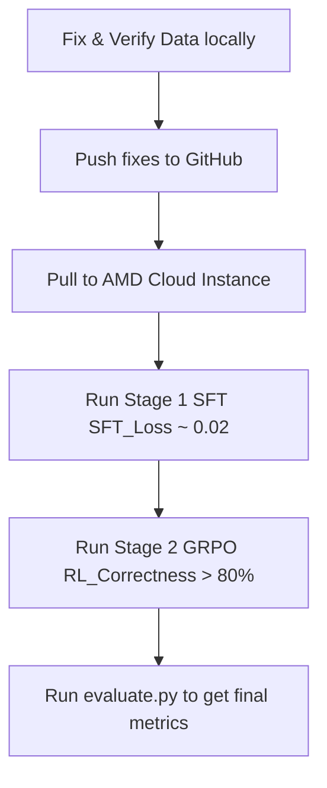

# 🧠 SFT & Reinforcement Learning: First-Principles Analysis

> **Date:** June 12, 2026
> **Status:** ⚠️ HISTORICAL — Written BEFORE GRPO was tested. GRPO/DAPO/RAFT all subsequently FAILED (see `grpo_first_principles_analysis.md`). SFT is the shipped model (0.862 composite).
> **Value:** Mathematical foundations of SFT loss (§1-2) and task-by-task audit (§3) remain valid and useful for judge Q&A. Sections referencing GRPO as "Stage 2 to run" are outdated.
> **Objective:** Evaluate the mathematical, conceptual, and clinical validity of SFT (Stage 1) and GRPO (Stage 2) on Gemma 4 31B.

---

## 📋 Executive Summary

Is our Supervised Fine-Tuning (SFT) approach correct, or are we just teaching a powerful base model to blindly "parrot" template responses?

1. **SFT is necessary but insufficient.** SFT serves as a **critical alignment phase (Cold Start)**. Without it, the model's output distribution has high entropy; it does not know our schema, task boundaries, or target vocabulary. Doing RL directly from a base model would fail due to the massive search space (reward sparsity).
2. **We ARE training Chain-of-Thought (CoT).** SFT is *not* a simple input $\rightarrow$ output direct mapping. The target assistant completions include `<|channel>thought\n{thinking_trace}\n<channel|>\n{answer_format}`. During SFT, the model actively learns to output a reasoning block *before* the answer.
3. **The Memorization Limit:** The sharp drop in SFT training loss ($1.2 \rightarrow 0.027$ by epoch 0.25) and the 4.3x train-eval gap ($0.027$ vs. $0.118$) show that the model is over-indexing on the structural templates of our synthetic diversity engine. 
4. **GRPO is the Core reasoning Engine:** Stage 2 (GRPO) breaks the parroting loop. While SFT teaches the model *how to format and speak*, GRPO uses outcome-based rewards (correctness, faithfulness, structured compliance) to teach the model *how to explore, logical-check, and reason*.

---

## 🔬 First-Principles: What SFT & RL Actually Do

To understand if our training is correct, we must look at the loss functions and objective criteria of SFT and Reinforcement Learning.

### 1. Supervised Fine-Tuning (SFT)
SFT optimizes the cross-entropy loss over the target sequence tokens:

$$\mathcal{L}_{\text{SFT}}(\theta) = -\sum_{i=1}^{T} \log P_{\theta}(y_i \mid y_{<i}, x)$$

*   **Mechanics:** For every token in the assistant response (since we use `completion_only_loss=True`), SFT maximizes its likelihood given the preceding tokens.
*   **Behavior:** SFT is a **probability-distribution squasher**. It takes the massive probability space of the base model and squashes it down to match the exact sequence style of our datasets.
*   **Limitation:** SFT does not know "truth" or "correctness". It only knows "imitation". If the target completion says `SERIOUS: YES`, the model is penalized for generating `SERIOUS: NO` even if `NO` is clinically correct under the narrative. It treats reasoning text and formatting text identically.

### 2. Reinforcement Learning (GRPO)
Group Relative Policy Optimization (GRPO) optimizes the policy directly using a relative reward signal without a separate critic network:

$$\mathcal{L}_{\text{GRPO}}(\theta) = -\frac{1}{G} \sum_{i=1}^{G} \min\left( r(\theta) \hat{A}_i, \text{clip}(r(\theta), 1-\epsilon, 1+\epsilon) \hat{A}_i \right)$$

where $A_i$ is the relative advantage of completion $i$ within a group of $G$ generations:

$$\hat{A}_i = \frac{R_i - \text{mean}(R)}{\text{std}(R)}$$

*   **Mechanics:** The model generates $G$ independent completions for the same prompt. Each completion is scored by our reward functions. The model is updated to favor the completions that score higher than the group average.
*   **Behavior:** GRPO behaves as an **outcome judge**. It does not care *which* exact words the model uses in the thinking block, as long as the reasoning refers to case facts (faithfulness reward) and arrives at the correct standardized classification (correctness reward).
*   **Synergy:** SFT sets the starting template (boundaries, style). GRPO refines the policy so that the model actually searches its parameter space to verify the facts before producing the label.

---

## 🔍 Task-by-Task First-Principles Audit

We audit each of the four tasks to check if the prompt and response designs are conceptually sound.

### Task 1: Seriousness Assessment
*   **Format:** Clinical narrative (outcome codes like `Hospitalization` or `Death` removed) $\rightarrow$ CoT $\rightarrow$ `SERIOUS: YES/NO` + criteria.
*   **Is SFT correct here?** Yes. SFT teaches the model to look for specific keywords and semantic equivalents (e.g. "succumbed" $\rightarrow$ Death, "transferred to ICU" $\rightarrow$ Life-threatening) and maps them to the five ICH E2A categories.
*   **Data Validity:** High. By forcing the model to generate the matched criteria and rationale, we prevent it from guessing. The removal of structured outcome codes from the input is critical—it stops SFT from learning a simple "if outcome_code in SERIOUS_CODES" Python-like rule, forcing it to read the clinical text.

### Task 2: MedDRA Coding
*   **Format:** Clinical sentence with target AE redacted as `[ADVERSE EVENT]` $\rightarrow$ CoT $\rightarrow$ `MedDRA PT: [PT]`.
*   **Is SFT correct here?** Yes. SFT is highly effective for mapping clinical synonymy (e.g., "severe chest pain" $\rightarrow$ Angina pectoris). 
*   **Data Validity:** High. Removing the FAERS T2 pairs (which had the answer in the prompt) and using BioDEX, PHEE, and ADE Corpus ensures that the model learns actual clinical mapping rather than copying.

### Task 3: Labelling Status
*   **Format:** Drug, class, mechanism, indication, AE $\rightarrow$ CoT $\rightarrow$ `LABELLED: YES/NO`.
*   **Is SFT correct here?** Partially. If the model only memorizes the label status of specific drug-AE pairs, it will fail on new drugs.
*   **Class-Aware Reasoning:** Including the pharmacological class (e.g., "Beta-blocker") and mechanism of action (e.g., "Beta-1 adrenergic receptor antagonist") changes this from a lookup task to a **pharmacological reasoning task**. The model can infer that because beta-blockers slow heart rate, bradycardia is a known, expected reaction (labelled).
*   **Data Validity:** Improved. The integration of OnSIDES parquet files for real FDA label ground truth replaces the broken frequency heuristic.

### Task 4: Causality Assessment
*   **Format:** Clinical narrative containing temporal, dechallenge, rechallenge, concomitant, and indication overlap details $\rightarrow$ CoT $\rightarrow$ `WHO-UMC Causality: [verdict]`.
*   **Is SFT correct here?** Yes. Causality is a multi-factor logic problem. SFT teaches the model to extract these factors from prose and apply the WHO-UMC rules.
*   **Data Validity:** High. The narrative format requires the model to perform information extraction (e.g., translating "the patient recovered after drug stop" $\rightarrow$ positive dechallenge) rather than reading structured table rows.

---

## ⚡ Critique of Current Training Signals & Fixes

### 1. The SFT Double-Wrap Tokenization Bug (Fixed)
*   **Problem:** Gemma 4's native chat template automatically starts assistant turns with the thinking token `<|channel>thought`. Our raw SFT dataset also contained `<|channel>thought` inside the assistant content. When run through `SFTTrainer`, the model was trained on:
    `...model\n<|channel>thought<|channel>thought{thinking}...`
    This corrupted the model's token alignment, causing it to generate repetitive gibberish (`own own own`) at inference time.
*   **Fix:** The SFT data loader now strips the manual opening tag before passing it to the trainer, allowing the tokenizer's chat template to wrap it once.

### 2. SFT Overfitting & Loss Plateau
*   **Observation:** SFT train loss hit a floor of 0.027 by epoch 0.25 and flatlined, while eval loss remained at 0.118.
*   **Interpretation:** This is typical of template-generated SFT data. The model rapidly memorized the structural text generated by our `Combinatorial Diversity Engine` (e.g., `Let me {assess} this case...`). Once it memorized the vocabulary distribution, it gained no further generalizable clinical reasoning.
*   **Solution:** We should limit SFT to **1 epoch** (which we do) and keep the learning rate low ($5 \times 10^{-5}$). SFT is only meant to establish the vocabulary and formatting layout. The actual reasoning parameters will be trained in GRPO.

---

## 🚀 Execution Strategy for AMD MI300X

To maximize performance on the AMD GPU, follow this sequence:

1.  **Stage 1 SFT (01_sft_train.py):** Run with the double-wrap fix. The target is a stable training loss curve without collapsing gradient norms.
2.  **Stage 2 GRPO (02_grpo_train.py):** Set beta to `0.0` or a very low value (e.g., `0.001` if policy collapse is detected). Check that `format_reward`, `task_structure_reward`, and `correctness_reward` rise during the run.
3.  **Validation (evaluate.py):** Ensure evaluation uses the correct token slicing (C1 fix: left-padded slice matching) to calculate true metrics.
