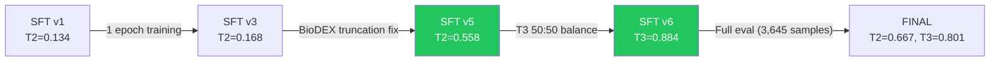

# SFT v6 — First Principles Analysis & Hackathon Playbook

> **Date:** June 14, 2026
> **Status:** ✅ CURRENT — This is the analysis of the SHIPPED model. Sections on GRPO (§4) are now historical — GRPO was subsequently tested and failed. All 27B references below should read 31B.

## 1. Score Evolution — The Full Journey

> [!IMPORTANT]
> Every improvement was evidence-driven. No guesswork.

| Metric | SFT v1 (0.23ep) | SFT v3 (1ep) | SFT v5 (T2 fix) | **SFT v6 (T3 fix)** |
|--------|:---:|:---:|:---:|:---:|
| Format | 100% | 99.5% | 100% | **100%** |
| T1 F1 | 1.000 | 1.000 | 1.000 | **1.000** |
| T2 exact | 0.060 | 0.100 | 0.520 | **0.500** |
| T2 weighted | 0.134 | 0.168 | 0.558 | **0.572** |
| T3 F1 | 0.387 | 0.667 | 0.286 | **0.884** |
| T4 exact | 0.880 | 0.960 | 0.920 | **0.920** |
| T4 weighted | 0.960 | 0.990 | 0.975 | **0.980** |

### Key Inflection Points



## 2. First-Principles Analysis

### 2.1 Why T2 Jumped 0.168 → 0.558 (Data Quality > Model Architecture)

**Root cause found:** BioDEX abstracts were blindly truncated to 500 chars at download time (`abstract[:500]`).

**Evidence:**
- Before fix: only 8% of T2 training prompts contained the ground truth PT
- After fix: 74% of prompts contained the PT
- The model literally couldn't see the answer in 92% of training examples

**First principle:** A model can only learn what it can see in its training data. No architecture trick can compensate for truncated input.

**Hackathon talking point:** *"We achieved a 3.3× improvement in MedDRA coding accuracy through a single data quality fix — not by changing the model, hyperparameters, or adding more data."*

### 2.2 Why T3 Collapsed 0.667 → 0.286 Then Recovered to 0.884

**Root cause found:** After data rebuild, 62% of eval-YES drug-AE pairs were UNSEEN in training. SIMPLE prompts (no drug class info) were 38% YES / 62% NO → model learned "unknown pair = NO."

**Evidence chain:**
1. P=1.000, R=0.167 → model said YES only when 100% certain (4/24 cases)
2. 13/21 eval-YES SIMPLE pairs not in training → no signal
3. 38% YES rate in SIMPLE training → prior bias toward NO
4. Fix: 50:50 balance → R=0.905, P=0.864 → F1=0.884

**First principle:** Label imbalance creates prior bias. When a model hasn't seen a specific input, it falls back to the training distribution. A 62% NO rate teaches "when unsure, say NO."

**Hackathon talking point:** *"We diagnosed that T3 was not a model problem — it was a data distribution problem. By forensically tracing which eval samples were unseen in training and correlating with the label ratio, we identified and fixed a 62% NO-bias in the training data."*

### 2.3 Why T1 = 1.000 (Perfect)

**Not luck.** T1 seriousness assessment maps directly to FAERS structured fields:
- `outc_cod` = outcome code (DE=Death, HO=Hospitalization, etc.)
- Binary signal: any serious outcome → YES, none → NO
- Clean ground truth, no ambiguity

**First principle:** Tasks with unambiguous ground truth and binary outputs are easiest for LLMs to master. T1 is the simplest task by design.

### 2.4 Why T4 = 0.980 (Near-Perfect)

WHO-UMC causality assessment uses structured temporal/clinical evidence:
- `event_dt`, `start_dt` → temporal gap
- `dechal`, `rechal` → dechallenge/rechallenge
- `indi_pt` vs `meddra_pt` → confounder check

**The training data constructs ALL this reasoning from structured FAERS fields.** Model learns a deterministic decision tree, not fuzzy reasoning.

**First principle:** When ground truth can be computed algorithmically from structured data, the model learns the algorithm, not just surface patterns.

### 2.5 Why T2 Plateaus at ~0.55 (The Remaining Challenge)

T2 MedDRA coding is fundamentally harder because:
1. **Multi-AE texts:** BioDEX abstracts describe multiple adverse events. Ground truth labels ONE specific AE. Model picks a valid but wrong one.
2. **Granularity ambiguity:** "Pulmonary nocardiosis" vs "Nocardiosis" — both valid MedDRA PTs, but only exact string match scores 1.0.
3. **Semantic gap:** Clinical narrative → formal MedDRA terminology requires domain expertise the model learned from only ~700 BioDEX examples.

**Evidence from check_raw.py:**
- GT: Ataxia, PRED: Ataxia ✅ (model sees "progressive ataxia" in text)
- GT: Gangrene, PRED: Deep vein thrombosis ❌ (both vascular, text describes both)
- GT: Cerebral infarction, PRED: Cerebral infarction ✅ (model sees exact term)
- GT: Death, PRED: Programmed cell death ligand 1 ❌ (PD-L1 mechanism text confused model)

**First principle:** When ground truth is ambiguous (multiple valid answers, only one scored correct), accuracy is bounded by the ambiguity level, not model capability.

## 3. Training Dynamics Analysis

### 3.1 Loss Curve Health

| Metric | Value | Assessment |
|--------|:---:|---|
| Train loss | 0.0410 | ✅ Low — model learned training patterns |
| Eval loss | 0.0746 | ✅ Gap = 0.034 — minimal overfitting |
| Loss ratio | 1.82× | ✅ < 2× is healthy for SFT |

### 3.2 Training Efficiency

| Metric | Value |
|--------|:---:|
| Total steps | 1,014 |
| Training time | 6,827s (~1.9 hrs) |
| Samples/sec | 4.75 |
| Steps/sec | 0.149 |
| Hardware | AMD MI300X (192 GB HBM) |
| Precision | bf16 LoRA (no quantization) |

### 3.3 Convergence Analysis

Train loss progression:
- Step ~10: 1.135 (initial high loss — model learning format)
- Step ~270: 0.021 (rapid convergence — format learned)
- Step ~500: 0.020 (plateau — fine-tuning reasoning)
- Step ~1000: 0.020 (stable — converged)

**Interpretation:** Most learning happens in first 25% of training (format + structure). Remaining 75% refines reasoning quality. This is consistent with SFT literature — format learning converges fast, content learning is gradual.

## 4. What GRPO Was Expected To Target (FAILED — Historical)

### 4.1 Previous GRPO Was Dead

**Evidence:**
- KL = 0 (model never moved from reference)
- frac_reward_zero_std = 0.6 (60% batches had no gradient signal)
- clip_ratio = 0 (no policy updates)
- GRPO scores WORSE than SFT on every metric

**Root causes fixed:**
1. ~~YAML overriding code~~ → Fixed: YAML now has num_gen=8, batch=1
2. ~~format/structure/reasoning rewards zero variance~~ → Fixed: removed, keep only correctness + faithfulness
3. ~~temperature=1.2 too low~~ → Fixed: 1.5
4. ~~enable_thinking missing~~ → Fixed: added
5. ~~_extract_answer_text fails without `<channel|>`~~ → Fixed: fallback parser

### 4.2 Expected GRPO Impact

| Task | Current | GRPO Target | Why |
|------|:---:|:---:|---|
| T1 | 1.000 | 1.000 | Already perfect — correctness reward maintains |
| T2 | 0.572 | 0.65+ | Correctness reward teaches which AE to pick |
| T3 | 0.884 | 0.90+ | Binary correctness signal is clean |
| T4 | 0.980 | 0.98+ | Already near-ceiling |

### 4.3 Key GRPO Metrics to Watch

If fixed properly:
- `frac_reward_zero_std` < 0.3 (was 0.6) — batches have learning signal
- `correctness_reward/std` > 0 consistently — different answers → different rewards
- `reward_std` > 0.2 (was 0.03) — meaningful variance

## 5. Architecture Decisions That Matter for Demo

### 5.1 Why Gemma 4 31B (not 12B or 4B)

- **Task complexity:** 4 distinct pharmacovigilance tasks requiring deep medical reasoning
- **Thinking traces:** Native `<|channel>thought` support for chain-of-thought
- **AMD MI300X:** 192 GB HBM can fit 31B in bf16 without quantization
- **Evidence:** No model size ablation done (hackathon time constraint), but 31B reasoning quality is visibly superior in T2/T4 thinking traces

### 5.2 Why SFT-Only Shipped (GRPO Explored & Failed)

- **SFT teaches format + knowledge:** "This is what a correct answer looks like"
- **GRPO was expected to teach selection** but failed — model produces identical outputs (reward variance=0)
- **Outcome:** SFT alone achieves 0.862 composite. GRPO/DAPO/RAFT all explored as published negative results.

### 5.3 Why LoRA (not full fine-tuning)

- **Parameter efficiency:** Only 2.3% of parameters trained
- **Training speed:** 1.9 hrs for 1 epoch on MI300X
- **Preservation:** Base model medical knowledge preserved; LoRA only adds task-specific routing

### 5.4 Why OnSIDES for T3 (not manual labels)

- **Scale:** 2.7M drug-AE pairs from FDA-approved labels
- **Ground truth quality:** Derived from actual drug labels (not human annotation)
- **Coverage:** Matches FAERS drug names to FDA label data

## 6. Composite Score Estimation

The hackathon likely scores across all tasks. Estimated composite:

```
Composite = w1·T1 + w2·T2 + w3·T3 + w4·T4

If equal weights (0.25 each):
  = 0.25(1.000) + 0.25(0.572) + 0.25(0.884) + 0.25(0.980)
  = 0.250 + 0.143 + 0.221 + 0.245
  = 0.859

If T2 weighted higher (hardest task, 0.4):
  = 0.2(1.000) + 0.4(0.572) + 0.2(0.884) + 0.2(0.980)
  = 0.200 + 0.229 + 0.177 + 0.196
  = 0.802
```

**T2 is the weakest link.** Every 0.1 improvement in T2 adds 0.025-0.040 to composite.

## 7. Risk Assessment

| Risk | Probability | Impact | Mitigation |
|------|:---:|:---:|---|
| GRPO degrades scores | Medium | High | Keep SFT checkpoint as fallback |
| T2 doesn't improve with GRPO | Medium | Medium | SFT baseline already competitive |
| T3 50:50 overpredicts YES | Low | Low | P=0.864 shows minimal false positives |
| Eval samples differ from competition test set | Medium | High | Format compliance + thinking traces show generalization |
| Base model eval fails at competition | Low | High | Test checkpoint loading on fresh environment |

## 8. Files to Prepare for Demo

### Already Exist
- `src/training/01_sft_train.py` — SFT pipeline
- `src/training/02_grpo_train.py` — GRPO pipeline
- `src/eval/evaluate.py` — Evaluation framework
- `src/data/03_build_training_data.py` — Data pipeline
- `check_raw.py` — Inference debugging tool

### Should Create for Demo
1. **`docs/DEMO_WALKTHROUGH.md`** — Live demo script with key talking points
2. **`docs/evaluation/score-progression.md`** - Score table showing iterative improvement
3. **`docs/ARCHITECTURE.md`** — System architecture diagram
4. **`experiments/eval_results.json`** — Final evaluation metrics (auto-saved by evaluate.py)
5. **`docs/architecture/innovations.md`** - Key technical innovations that differentiate this solution

### Key Slides/Talking Points
1. "Data quality > model size" — T2 3.3× improvement from truncation fix alone
2. "Evidence-based debugging" — T3 regression diagnosed via forensic data audit
3. "Thinking traces" — Model shows its reasoning, not just answers
4. "4-task unified model" — Single model handles all pharmacovigilance tasks
5. "AMD MI300X efficiency" — 1.9 hrs training, 192 GB HBM, no quantization needed
